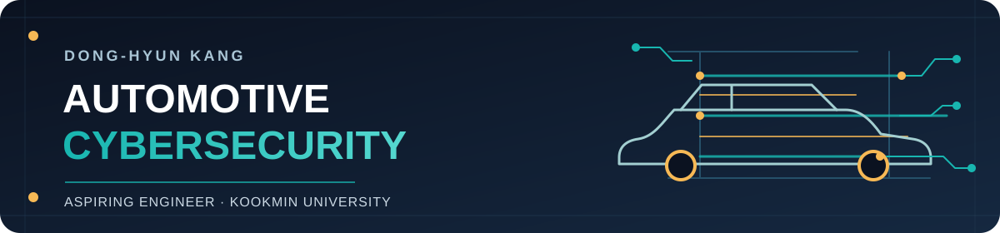

<picture>
  <source media="(max-width: 600px)" srcset="./assets/hero-mobile.svg">
  
</picture>

  
  
  

## 👋 About Me

- **Education** — B.S. student in Automotive IT Convergence, Kookmin University
- **Community** — KUSE organizer and System Hacking Study Leader
- **Career goal** — Automotive Cybersecurity Engineer
- **Focus** — In-vehicle networks, CAN fuzzing, and security testing

## 🚗 Featured Projects

### Multi-Bus Automotive Fuzzing

**Team Lead · 2020 Audi A5 · In progress**  
Leading a team-built Python multi-bus CAN fuzzer. I connected to the J533 gateway and contributed mutation, anomaly feedback, and distributed-trial components to the shared codebase.

### AutoHack 2026 · EVSE Team

Contributing to AutoHack 2026 challenge development. Further project details will be shared after the event.

### SEA:ME Hackathon 2026 · Autonomous Scale-Car

Contributed OpenCV lane perception and PD steering to a team-built ROS 2 driving pipeline; tuned them through physical track tests.

## ⚡ Experience

- **Vector Korea Challenge Validation:** Supporting test and validation of automotive cybersecurity challenges.
- **KUSE System Hacking Study:** Lead weekly Dreamhack fundamentals and wargame sessions covering ROP, ret2libc, GDB, and pwntools.

## 🛠️ Skills & Tools

**Intermediate · Python, C, Linux/Ubuntu, Git/GitHub**  

**Project experience · ROS 2, OpenCV**  

**Automotive & security**  
  

## 🏆 Award

**CTF Winner** · 32nd Hacking Camp, POC Security (February 2026)

## 📬 Contact

[GitHub](https://github.com/canhyeon-debug) · [LinkedIn](https://www.linkedin.com/in/cannhyun) · [Email](mailto:canhyeon@kookmin.ac.kr)
